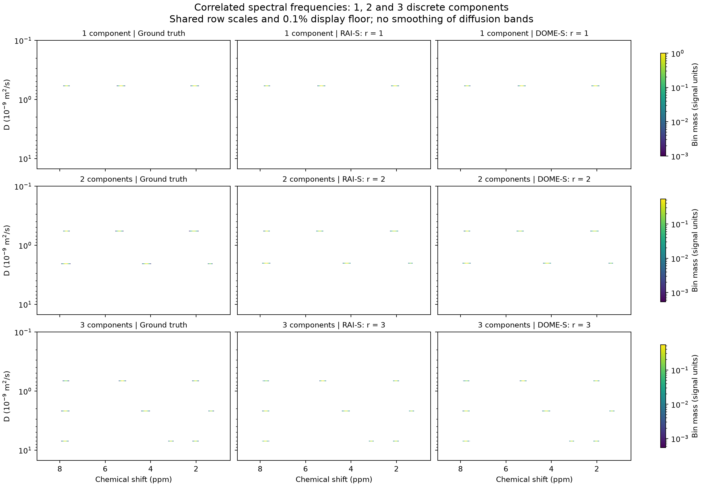

# TRAIn-DOSY: inversión conjunta positiva de Laplace
[English](README.md) · [API](docs/API_ES.md) · [Matemática](docs/METHODS_ES.md) · [Procedencia](docs/PROVENANCE.md) · [Artículo](paper/output/pdf/Positive_Joint_Laplace_Inversion_Mathematics.pdf)

Software de investigación de **Francisco M. Arrabal-Campos** para reconstrucción DOSY conjunta a partir de las regiones con señal del espectro completo. La línea MF procede del **TRAIn original de Xu y Zhang**, a través de la extensión **TRAIn_DOSY_MFV31 de Arrabal-Campos**. Se conservan tanto ese archivo histórico como la referencia numérica posterior.

## Implementaciones incluidas
| Lenguaje | Contenido | Función |
|---|---|---|
| MATLAB | TRAIn_DOSY_MFV31 histórico; DOSY_MF_Auto y MF restringido nativos | Perfiles distribucionales/polímeros, ≥256 bins, NNLS de MATLAB instalado |
| Python | RAI-S/DOME-S congelados, validación, CLI, API REST, benchmark y figuras | Tasas discretas compartidas y selección automática de soporte y orden |
| C#/.NET 10 | SDK tipado y cliente de consola | Usa la misma API; no es un tercer solver numérico independiente |
| Backend MF de la API | Ejecuta MATLAB nativo si el operador lo configura | Mantiene el algoritmo y los requisitos de licencia de MATLAB |

El MF de referencia y el núcleo atómico conservan su código y sus hashes. La publicación añade interfaces y reproducibilidad. No se elimina por porcentaje de altura ni se suministra al algoritmo el número verdadero de componentes.

## Instalación de Python
Python ≥3.11; probado con Python 3.13.13:
~~~sh
git clone https://github.com/fmarrabal/train-dosy.git
cd train-dosy
python -m venv .venv
~~~
Windows:
~~~powershell
.\.venv\Scripts\Activate.ps1
python -m pip install -e ".[api,test,plots]"
~~~
Linux/macOS:
~~~sh
source .venv/bin/activate
python -m pip install -e ".[api,test,plots]"
~~~
requirements-lock.txt registra las versiones usadas; instalarlo antes del paquete editable para reproducir ese entorno. No se promete identidad binaria entre sistemas.

## Ejemplo completo
~~~sh
train-dosy examples/three_components/input.json resultado.json --method RAI-S
train-dosy examples/three_components/input.json dome-resultado.json --method DOME-S
python scripts/make_examples.py
python scripts/plot_examples.py
~~~
Las dos primeras órdenes ajustan las observaciones. Las otras regeneran ejemplos fijos de 1, 2 y 3 componentes y sus mapas DOSY con ground truth. input.json solo contiene entradas permitidas; truth.json está separado y nunca lo lee fit(). Los resultados guardados y examples/summary.json registran diagnósticos y error sobre ocho gradientes externos.

Uso directo:
~~~python
import json
from train_dosy import fit
entrada = json.load(open("examples/two_components/input.json"))
salida = fit(entrada)
print(salida["selected_rank"], salida["D"], salida["success"])
~~~

## Preparar datos reales
Y debe ser real y estar faseada: filas de adquisición por columnas de desplazamiento químico. Mantener el signo del ruido. b se expresa en s/m², D en m²/s, y bD es adimensional. No sustituir b por G² ni estimar unidades a ojo: el cálculo depende de la secuencia. La corrección de fase/base y la conversión física son previas. sigma debe ser positiva y estar en las unidades de Y; se supone ruido gaussiano homogéneo conocido.

Se seleccionan regiones con señal sobre el espectro completo y se ajustan conjuntamente sus frecuencias. La máscara excluye disolvente y línea base; esas frecuencias quedan sin estimar. El descubrimiento automático excluye filas de validación interna. Un ajuste independiente a un punto no equivale a recuperar componentes correlacionados entre frecuencias. [Contrato y límites](docs/API_ES.md).

En RAI-S y DOME-S, la malla de al menos 256 bins conserva masa para dibujar; las tasas se optimizan de forma continua. Más bins de dibujo no mejoran la resolución física. En MF las masas de esa malla sí son las incógnitas. Para representar densidad hay que dividir por el ancho del bin.

## MATLAB
Requiere MATLAB y Optimization Toolbox; probado con R2026a:
~~~matlab
addpath('matlab');
r = example_mf();
imagesc(r.ppm, log10(r.D), r.X);
set(gca,'XDir','reverse'); xlabel('ppm'); ylabel('log_{10} D (m^2/s)');
~~~
Uso directo:
~~~matlab
addpath('matlab/reference');
D = logspace(-10, log10(15e-9), 256)';
% Y solo contiene frecuencias seleccionadas; b y sigma tienen unidades físicas.
% La máscara no debe usar validación ni prueba externa.
[X,D,info] = DOSY_MF_Auto(Y,b,D,sigma,innerRows,validationRows,struct());
~~~
innerRows y validationRows son vectores lógicos disjuntos; el reajuste final usa su unión. Revisar info.status y, si existe, info.fit.kkt. Un resultado no resuelto no identifica especies.

matlab/legacy/TRAIn_DOSY_MFV31.m conserva la interfaz histórica de V3.1. D_params, reescalado opcional de b, suavizado y umbrales difieren de la referencia posterior. Se publica como antecedente, no como el selector automático validado en este artículo.

## API REST y C#
~~~sh
python -m uvicorn train_dosy.api:app --host 127.0.0.1 --port 8765
dotnet build csharp/TrainDosy.Cli -c Release
dotnet run --project csharp/TrainDosy.Cli -c Release -- examples/three_components/input.json csharp-resultado.json
~~~
Swagger: http://127.0.0.1:8765/docs . [Endpoints, unidades, errores, límites y backend MATLAB](docs/API_ES.md). El cliente admite una tercera opción con la URL del servidor y Ctrl+C para cancelar. Devuelve código distinto de cero si falla HTTP y código 3 si el solver no resuelve el ajuste.

SDK:
~~~csharp
using var http = new HttpClient {
    BaseAddress = new Uri("http://127.0.0.1:8765/"),
    Timeout = TimeSpan.FromMinutes(11)
};
var resultado = await new TrainDosy.DosyClient(http).FitAsync(entrada, cancellationToken);
~~~
En MATLAB, request = jsondecode(fileread('examples/one_component/input.json')); result = dosy_api(request); llama al mismo servicio local.

## Reproducir benchmark y artículo
~~~sh
python -m pytest -q
python benchmarks/run_atomic.py --count 48 --output benchmark_run
python paper/scripts/prepare_evidence.py
~~~
Compilación en PowerShell:
~~~powershell
.\paper\build.ps1
~~~
En otros sistemas, ejecutar pdflatex tres veces sobre main.tex desde paper/, con MiKTeX/TeX Live y las dependencias de la plantilla. Se incluyen fuentes editables y avisos originales de MDPI.

El protocolo tiene 36 casos discretos con señal, seis nulos y seis controles anchos. La recuperación conjunta de orden y todas las tasas es: RAI 17/36; RAI-S 23/36; DOME 22/36; DOME-S 23/36. Si solo se cuenta acertar el orden, los valores son 17, 25, 26 y 25 de 36. La coincidencia de los métodos S no es una replicación independiente. Las distribuciones poliméricas anchas requieren otra representación.

La figura MF original del manuscrito conserva el resultado guardado. No se afirma superioridad universal, óptimo global, identificación química, nueva validación experimental ni reentrenamiento completo de las variantes neuronales exploratorias. [Alcance y límites](docs/METHODS_ES.md). El benchmark completo puede tardar; los tres ejemplos no lo sustituyen.

## Organización
- src/train_dosy: contrato, API, CLI y estimador Python congelado.
- matlab/reference: MF nativo, NNLS, simplex, refinamiento y selección automática.
- matlab/legacy: TRAIn_DOSY_MFV31 original.
- csharp: SDK reutilizable y CLI.
- examples: entradas, verdad separada, ajustes y figuras.
- benchmarks: generador, evaluación y métricas previas por problema.
- paper: LaTeX, PDF, entradas sintéticas mínimas, tablas y figuras.
- provenance y verification: hashes y pruebas locales.
- docs: documentación bilingüe y atribución.

## Citas, licencia y estado
[CITATION.cff](CITATION.cff) contiene la cita del software. Citar también [TRAIn original](https://doi.org/10.1021/ac402698h) al describir la procedencia. Se incorporan tus trabajos sobre [diffGA](https://doi.org/10.1039/c7sm01569k), [dART](https://doi.org/10.1021/acs.jpca.8b08584) y [Kaczmarz regularizado](https://doi.org/10.3390/math13132166), junto con los estudios de peso molecular y la corrección de 2016.

Software GPL-3.0-or-later; [NOTICE](NOTICE) recoge atribuciones y dependencias. MATLAB se licencia aparte. v0.1.0 es software de investigación con un manuscrito en borrador: autoría definitiva, afiliaciones, financiación y conflictos siguen pendientes. No implica envío a la revista. Las comprobaciones son locales; no se instalan ni necesitan workflows de GitHub Actions.

